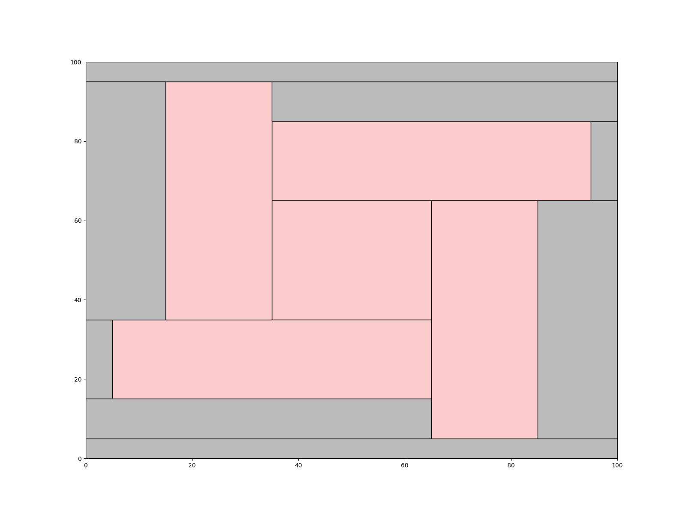
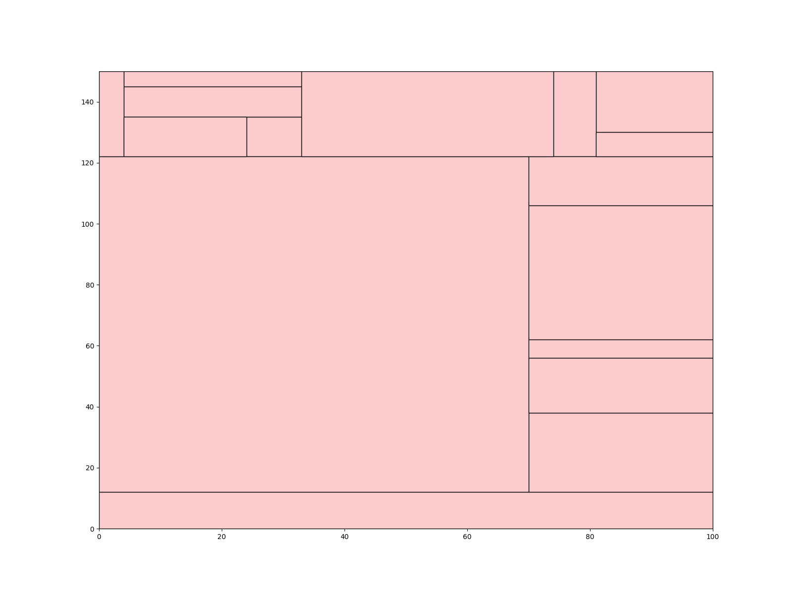
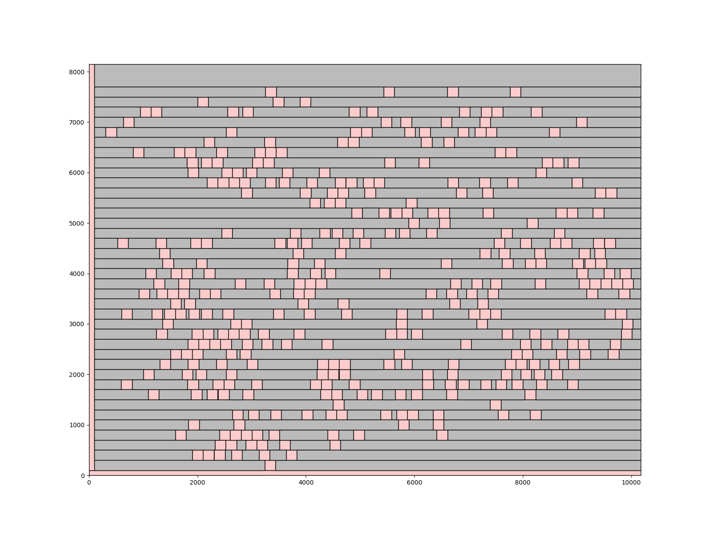
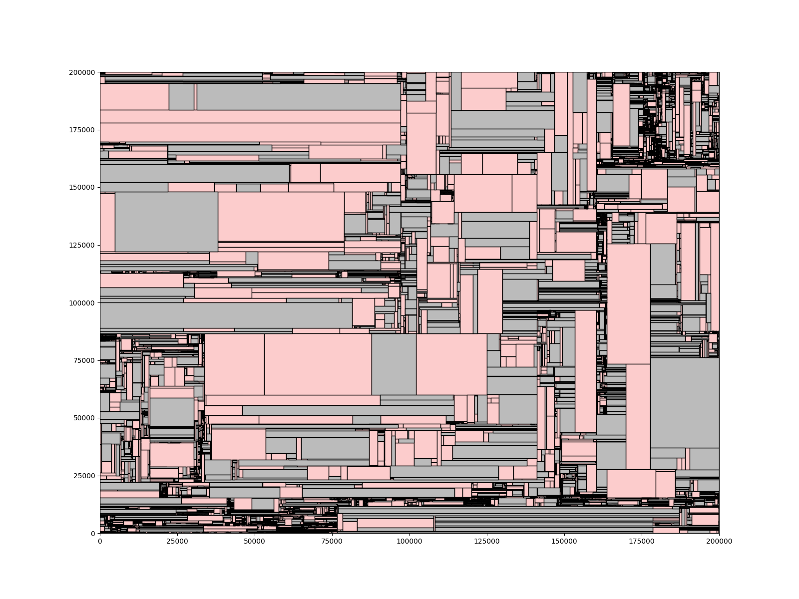

# Corner Stitching

>This is an exercise lab to review corner stitching data structure. You have to organize the  
space tiles as maximal horizontal stripes. This means that no space tile has other space tiles  
immediately to its right or left and every space tile must be as wide as possible.

## Objective
* Implement the overall corner stitching data structure
* Implement Point_Finding & Block_Insertion functions

## Result
* Implement with C++ / Visulaization with Python
<table>
  <tr>
    <td></td>
    <td></td>
  </tr>
  <tr>
    <td></td>
    <td></td>
  </tr>
</table>
