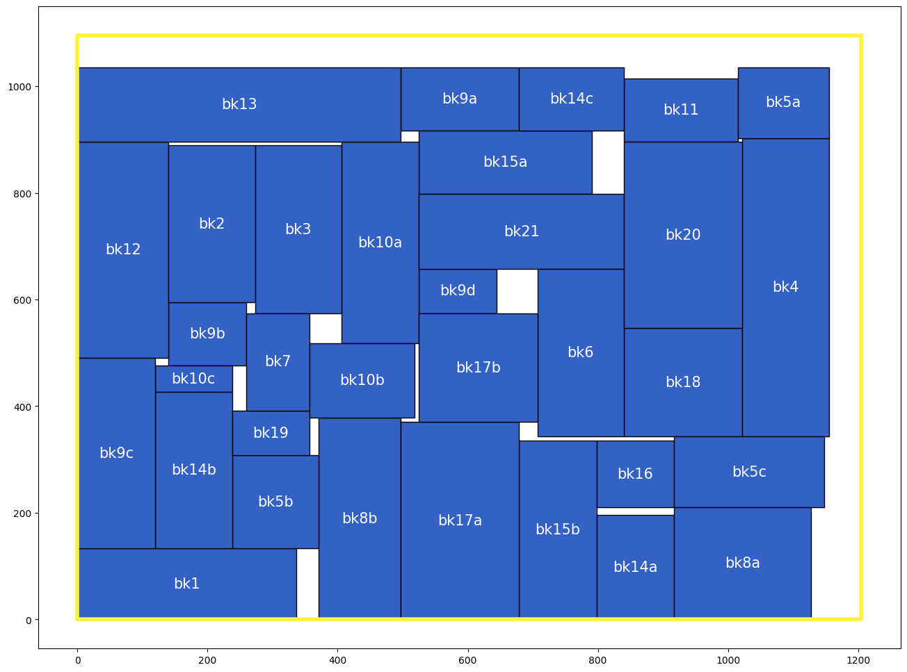

# Fixed Outline Floorplanning

## Introduction

This programming assignment asks you to write a fixed-outline floorplanner to handle hard 
macros. Given a set of rectangular macros and nets, the floorplanner places all macros within a 
rectangular chip without any overlaps. We assume that the lower-left corner of this chip is the 
origin (0, 0), and no space (channel) is needed between two different macros. The objective is

to minimize the area of the chip bounding box and the total net wire length. 
The total wirelength W of a set N can be computed by

 

  𝑊 = ∑ 𝐻𝑃𝑊𝐿( 𝑛𝑖 )   𝑛𝑖 ∈ 𝑁 

where ni denotes a net in N, and HPWL(ni) denotes the half-perimeter wire length of ni. 
The objective for this problem is to minimize 
𝐶𝑜𝑠𝑡 =  𝛼𝐴 + (1 − 𝛼)𝑊 (Note: Cost is integer.) 
where A denotes the bounding-box area of the floorplan, and α, 0 ≦α ≦1, is a user defined ratio to 
balance the final area and wirelength. Note that a floorplan which cannot fit into the given outline 
is not accepted.

## Implementation

<ul style="font-size: 20px;">
  <li>Sequence Pair</li>
  <li>B* Tree</li>
</ul>

## Result
<table>
  <tr>
    <td>
      
      
ami33

    </td>
    <td>
      
      
ami49

    </td>
  </tr>
</table>

## Simulated Annealing flow
> ### Init stage
> 
 Randomize Sequence pair, Cost = Area outside of outline 

 

> ### Stage 0
> 
 Simulated annealing, Cost = Area outside of outline 

 

> ### Stage 1
> 
 Simulated annealing, Cost = True cost function 

 

> ### Stage 2
> 
 Try different seeds & save best, Cost = Area outside of outline 

 
