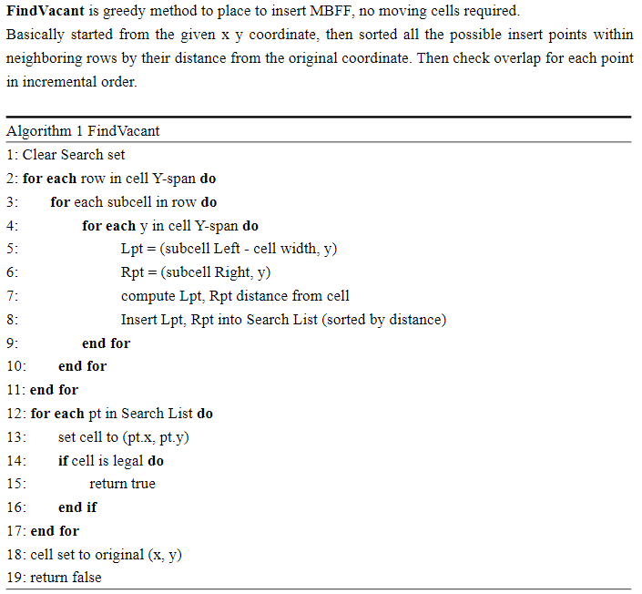
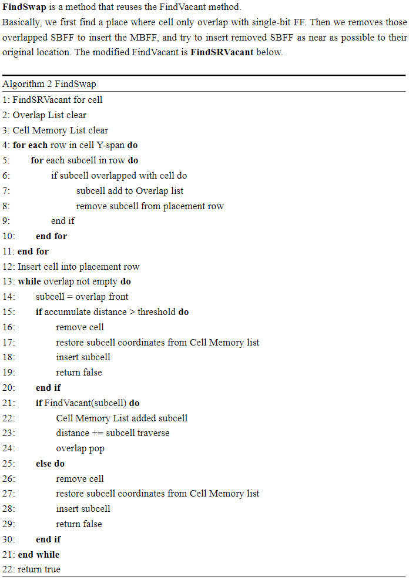
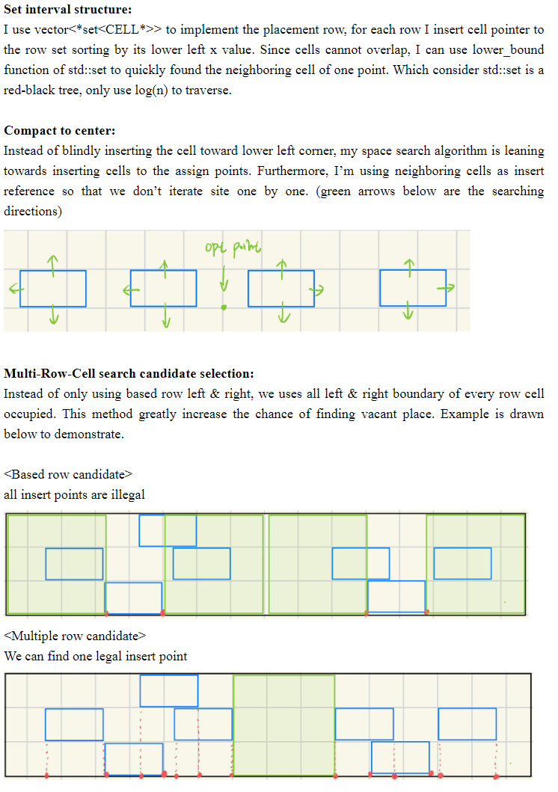
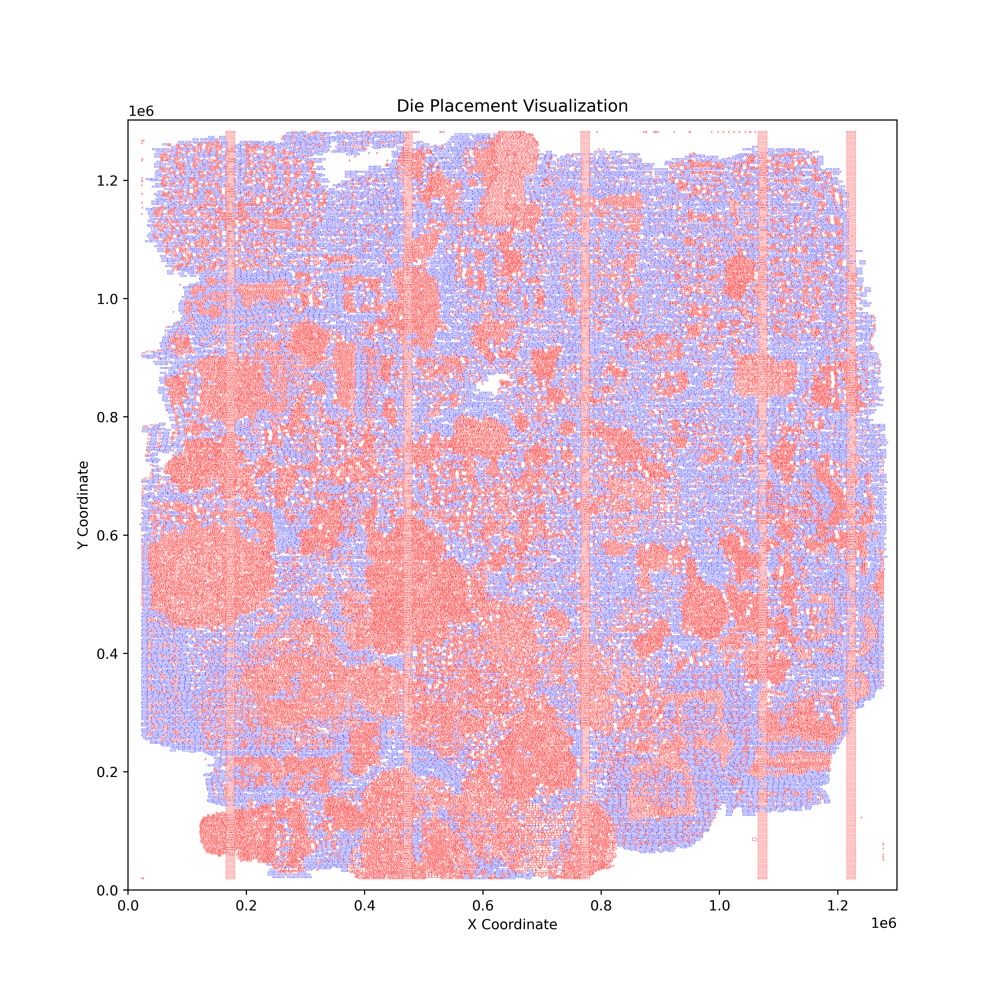
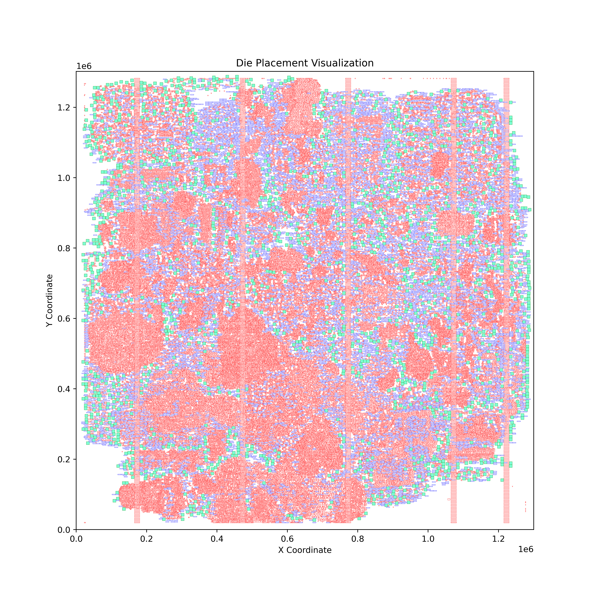
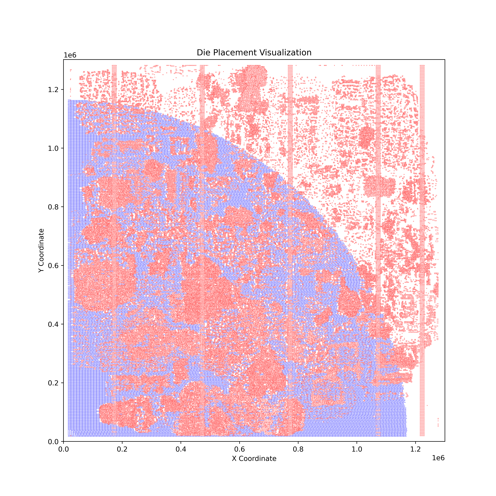
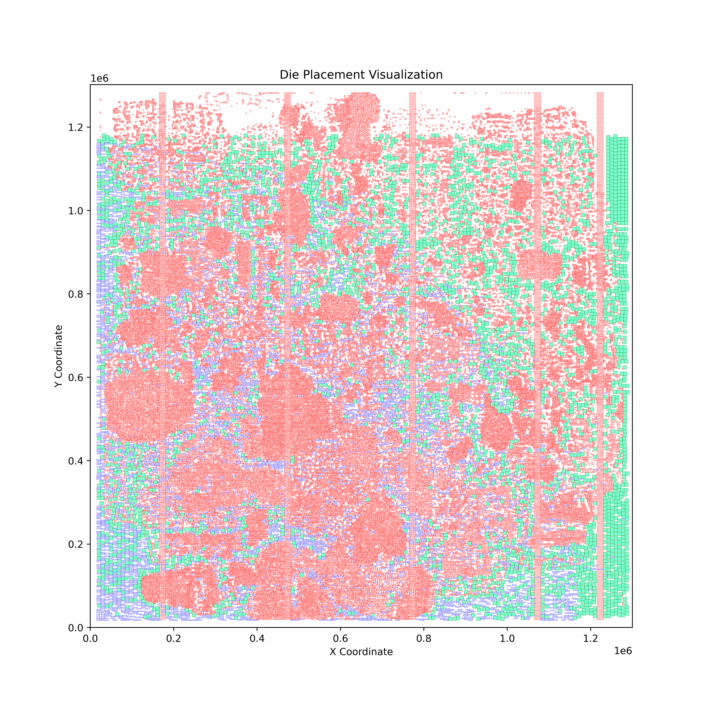
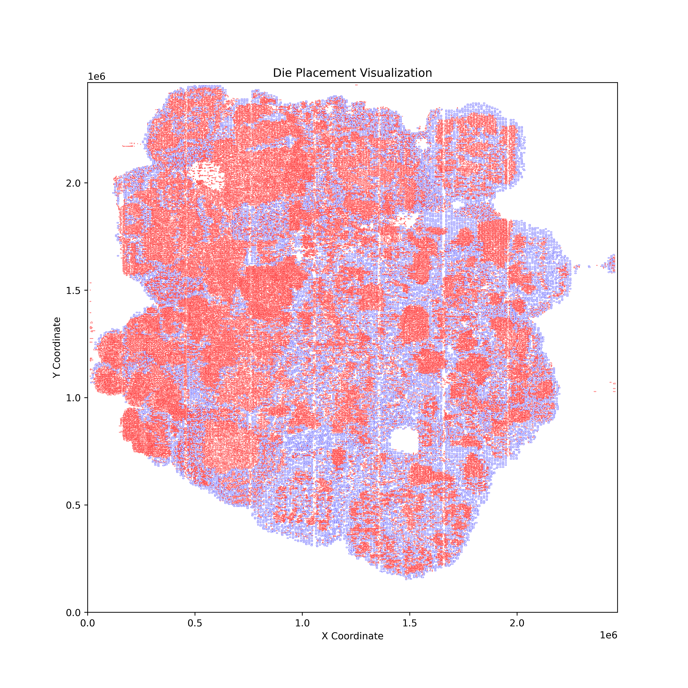
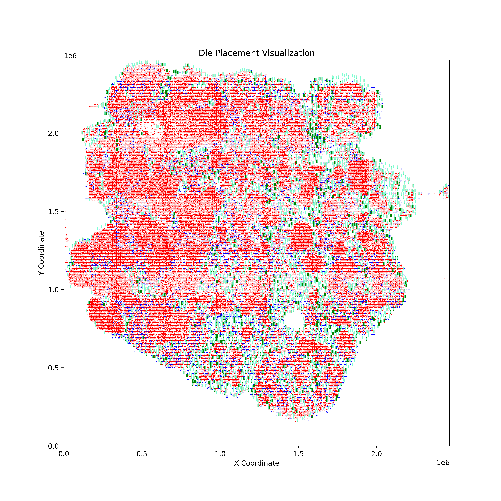
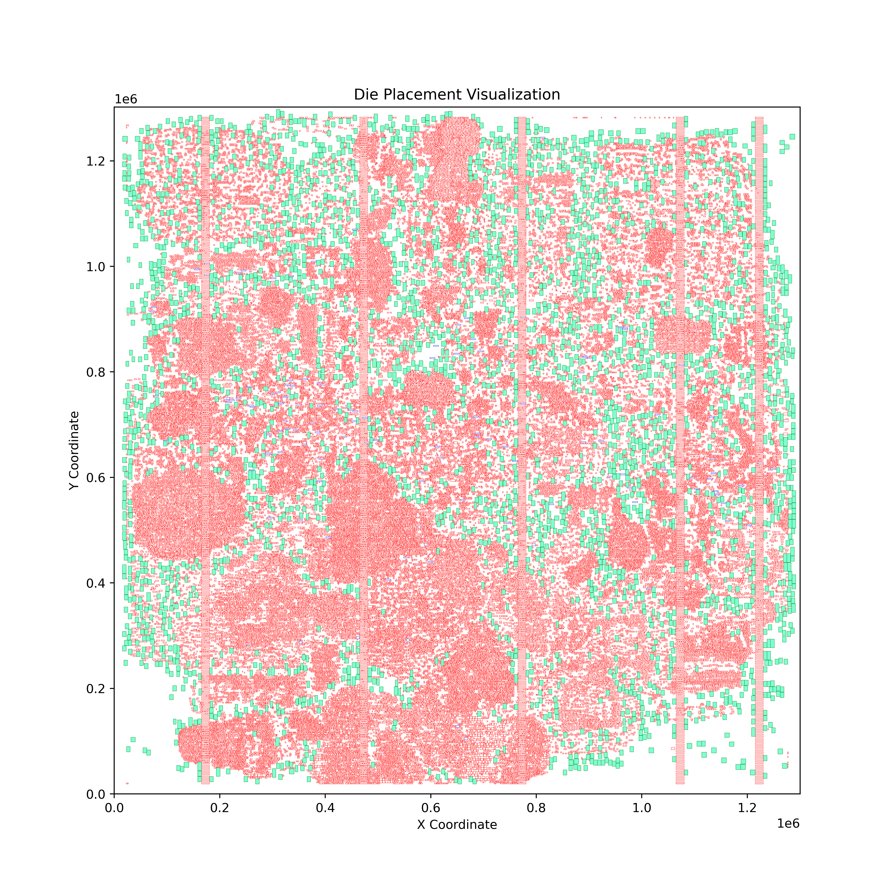

# Legalization of Multi-bit FF Banking Placement

## Introduction
>Many optimization techniques can result in cell overlap, leading to illegal placement. Therefore, a fast algorithm is needed to perform local legalization rather than full-chip legalization and determine whether the optimization is feasible at that moment. Consequently, a quick API for the legalizer is necessary so that the optimizer can frequently check whether the optimization is easy to legalize.

## Proposed Algorithm => [Report](313510171_rpt.pdf)
<ul style="font-size: 20px;">
  <li>FindVacant</li>
  
   
   
  <li>FindSwap</li>
  
   
   
  <li>Other Features</li>
  
</ul>

## Result
* 
 testcase1_16900 

<table>
  <tr>
    <td>
      
      
Original Placement

    </td>
    <td>
      
      
After Banking

    </td>
  </tr>
</table>

* 
 testcase1_ALL0_5000 

<table>
  <tr>
    <td>
      
      
Original Placement

    </td>
    <td>
      
      
After Banking

    </td>
  </tr>
</table>

* 
 testcase2_100 

<table>
  <tr>
    <td>
      
      
Original Placement

    </td>
    <td>
      
      
After Banking

    </td>
  </tr>
</table>

* 
 Hellish testcase 

<table>
  <tr>
    <td>
      
      
Original Placement

    </td>
    <td>
      
      
After Banking

    </td>
  </tr>
</table>