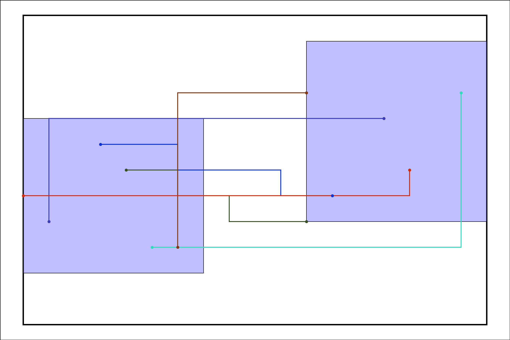
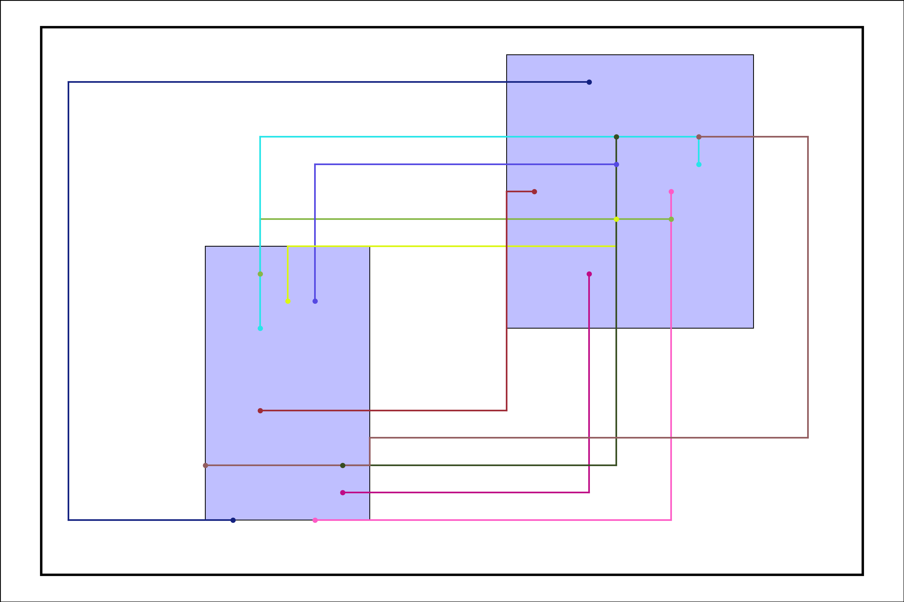

#  Die-to-Die Global Routing

## Introduction

Global Routing (GR) is an important step in the IC design flow used to determine the

approximate paths for signal nets across the design space. This process mainly focuses on

assigning "routing resources" and providing a "coarse routing solution" for subsequent 

Detailed Routing (DR).
Its primary goals include:
 
 

* Path Planning:
Determine a global connection path for each signal net without specifying the exact 
placement of wires.

* Resource Allocation:
Ensure that routing resources (such as metal layers and routing tracks) are utilized efficiently across the design to avoid congestion.

* Feasibility Check:
Provide a congestion map to evaluate whether the design is routable and offer optimization suggestions.

* Performance Optimization: Minimize routing length and total delay while meeting requirements for timing, power, and reliability.

## Implement
* A* Search Algorithm
* Gcell data structure
* Efficient Openlist & Closelist data structure

## Result
<table>
  <tr>
    <td>
      
    </td>
    <td>
      
    </td>
  </tr>
</table>

<table>
  <tr>
    <td>
      
    </td>
    <td>
      
    </td>
  </tr>
</table>

<table>
  <tr>
    <td>
      
    </td>
    <td>
      
    </td>
  </tr>
</table>